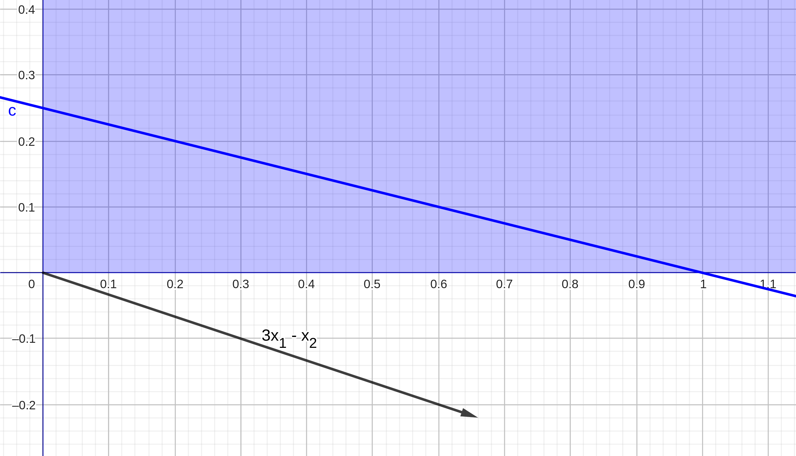

# MAC0315 - Otimização Linear

## Prova 1

João Pedro Lukasavicus Silva  
joao.lukasavicus.silva@usp.br  
9276940  

### 1.

Com a restrição de que $x_{3} = 0$, nosso problema de minimização fica equivalente a:
$$
\begin{aligned}
\text{minimizar } \quad 3 x_{1} - x_{2} \\
\text{sujeito a } \quad x_{1} + 4 x_{2} & = 1 \\
x_{1} & \geq 0\\
x_{2} & \geq 0\\
\end{aligned}
$$

#### a) Resolvendo o problema graficamente:

Na imagem a seguir, a área em azul claro corresponde às restrições $x_{1} \geq 0$ e $x_{2} \geq 0$, enquanto que a linha azul escura corresponde à restrição $x_{1} + 4x_{2} = 1$, e a seta de cor preta indica a direção para onde a função $3x_{1} - x_{2}$ cresce mais rapidamente.

{ width=100% }

#### b) Soluções básicas:

As restrições de igualdade que temos são:  
$$
x_{1} + 4 x_{2} = 1
$$
e
$$
x_{3} = 0
$$
Para termos uma solução básica, precisamos então de (ao menos) mais uma restrição ativa, já que estamos em $\mathbb{R}^{3}$. Assim, para $x_{1} = 0$, temos:
$$
\begin{aligned}
x_{1} & = 0\\
4 x_{2} & = 1\\
x_{2} & = \frac{1}{4}\\
x_{3} & = 0\\
\end{aligned}
$$
E, para $x_{2} = 0$, temos:
$$
\begin{aligned}
x_{2} & = 0\\
x_{1} & = 1\\
x_{3} & = 0\\
\end{aligned}
$$
Então os pontos $(0, \frac{1}{4}, 0)$ e $(1, 0, 0)$ são as soluções básicas do problema. (Note que ambas são soluções viáveis, então ambas soluções são viáveis básicas).

### 2. 

Seja $z_{1} = |x_{1}|$. Então $z_{1}$ é o menor número real tal que $z_{1} \geq x_{1}$ e $z_{1} \geq -x_{1}$ simultaneamente.  
Seja $z_{2} = \text{max}\{2x_{1} - x_{2}, 3x_{1} + x_{2}\}$. Então podemos dizer que $z_{2}$ é o menor número real tal que $z_{2} \geq 2x_{1} - x_{2}$ e $z_{2} \geq 3x_{1} + x_{2}$ simultaneamente. Então nosso problema de otimização é equivalente a:
$$
\begin{aligned}
\text{minimizar } \quad 2z_{1} + z_{2}\\
\text{sujeito a } \quad z_{1} \geq x_{1}\\
z_{1} \geq - x_{1}\\
z_{2} \geq 2x_{1} - x_{2}\\
z_{2} \geq 3x_{1} + x_{2}\\
(x_{1}, x_{2}) \in P\\
\end{aligned}
$$
Ou, finalmente:
$$
\begin{aligned}
\text{minimizar } \quad 2z_{1} + z_{2}\\
\text{sujeito a } \quad z_{1} - x_{1} \geq 0\\
z_{1} + x_{1} \geq 0\\
z_{2} - 2x_{1} + x_{2} \geq 0\\
z_{2} - 3x_{1} - x_{2} \geq 0\\
(x_{1}, x_{2}) \in P\\
\end{aligned}
$$

### 3.

Seja $E_{i} = |y(x_{i}) - y_{i}|$.  
Seja $y(x_{i}) = ax_{i}^{3} + bx_{i}^{2} + cx_{i} + d$. Então temos que:
$$
\begin{aligned}
y(x_{1}) & = -8a + 4b - 2c + d\\
y(x_{2}) & = -a + b - c + d\\
y(x_{3}) & = d\\
y(x_{4}) & = a + b + c + d\\
y(x_{5}) & = 8a + 4b + 2c + d
\end{aligned}
$$

#### a) Minimize o erro máximo
Seja $z = \text{max}_{1 \leq i \leq 5}\{E_{i}\}$. Então nosso problema é equivalente a minimizar $z$ tal que $z$ seja maior ou igual a $E_{1}, \ldots, E_{5}$.  
Como $z \geq E_{i} = |y(x_{i}) - y_{i}|$, temos que $z$ é o menor número real tal que $z \geq y(x_{i}) - y_{i}$ e $z \geq y(x_{i}) - y_{i}$, simultaneamente.  
Então nosso problema pode ser escrito como:
$$
\begin{aligned}
\text{minimizar } \quad & z\\
\text{sujeito a } \quad
& z \geq y(x_{1}) - y_{1}\\
& z \geq y_{1} - y(x_{1})\\
& z \geq y(x_{2}) - y_{2}\\
& z \geq y_{2} - y(x_{2})\\
& z \geq y(x_{3}) - y_{3}\\
& z \geq y_{3} - y(x_{3})\\
& z \geq y(x_{4}) - y_{4}\\
& z \geq y_{4} - y(x_{4})\\
& z \geq y(x_{5}) - y_{5}\\
& z \geq y_{5} - y(x_{5})\\
\end{aligned}
$$
Ou então, 
$$
\begin{aligned}
\text{minimizar } \quad & z\\
\text{sujeito a } \quad
& z \geq -8a + 4b - 2c + d + 13 \\
& z \geq 8a - 4b + 2c - d - 13\\
& z \geq -a + b - c + d - 2\\
& z \geq a - b + c - d + 2\\
& z \geq d - 3\\
& z \geq 3 - d\\
& z \geq a + b + c + d - 2\\
& z \geq 2 - a - b - c - d\\
& z \geq 8a + 4b + 2c + d - 11\\
& z \geq 11 - 8a - 4b - 2c - d\\
\end{aligned}
$$
E finalmente:
$$
\begin{aligned}
\text{minimizar } \quad & z\\
\text{sujeito a } \quad
& z + 8a - 4b + 2c - d - 13  & \geq 0\\
& z - 8a + 4b - 2c + d + 13  & \geq 0\\
& z + a - b + c - d + 2  & \geq 0\\
& z - a + b - c + d - 2  & \geq 0\\
& z + 3 - d  & \geq 0\\
& z + d - 3  & \geq 0\\
& z + a + b + c + d - 2  & \geq 0\\
& z + 2 - a - b - c - d  & \geq 0\\
& z + 11 - 8a - 4b - 2c - d & \geq 0\\
& z + 8a + 4b + 2c + d - 11 & \geq 0\\
\end{aligned}
$$

#### b) Minimize o erro total
Note que esse problema consiste em minimizar a soma $\sum_{1}^{5} E_{i}$. Então podemos escrever este problema como:
$$
\begin{aligned}
\text{minimizar } \quad
& E_{1} + E_{2} + E_{3} + E_{4} + E_{5}\\
\text{sujeito a } \quad
& E_{1} \geq y(x_{1}) - y_{1}\\
& E_{1} \geq y_{1} - y(x_{1})\\
& E_{2} \geq y(x_{2}) - y_{2}\\
& E_{2} \geq y_{2} - y(x_{2})\\
& E_{3} \geq y(x_{3}) - y_{3}\\
& E_{3} \geq y_{3} - y(x_{3})\\
& E_{4} \geq y(x_{4}) - y_{4}\\
& E_{4} \geq y_{4} - y(x_{4})\\
& E_{5} \geq y(x_{5}) - y_{5}\\
& E_{5} \geq y_{5} - y(x_{5})\\
\end{aligned}
$$
Ou, finalmente:
$$
\begin{aligned}
\text{minimizar } \quad
& E_{1} + E_{2} + E_{3} + E_{4} + E_{5}\\
\text{sujeito a } \quad
& E_{1} + 8a - 4b + 2c - d - 13  & \geq 0\\
& E_{1} - 8a + 4b - 2c + d + 13  & \geq 0\\
& E_{2} + a - b + c - d + 2  & \geq 0\\
& E_{2} - a + b - c + d - 2  & \geq 0\\
& E_{3} + 3 - d  & \geq 0\\
& E_{3} + d - 3  & \geq 0\\
& E_{4} + a + b + c + d - 2  & \geq 0\\
& E_{4} + 2 - a - b - c - d  & \geq 0\\
& E_{5} + 11 - 8a - 4b - 2c - d & \geq 0\\
& E_{5} + 8a + 4b + 2c + d - 11 & \geq 0\\
\end{aligned}
$$

### 4.
Seja $F_{i}$ a quantidade (em litros) de perfume fabricados no mês $i$, e $E_{i}$ a quantidade (em litros) de perfume estocados ao final do mês $i$.  
Então podemos escrever nosso problema como:
$$
\begin{aligned}
\text{minimizar } \quad
& \frac{10(F_{1} + F_{2}) + 11(F_{3} + F_{4})}{2} +
E_{1} + E_{2} + E_{3}\\
\text{sujeito a } \quad
& 2000 + F_{1} & \geq 4000\\
& E_{1} + F_{2} & \geq 5000\\
& E_{2} + F_{3} & \geq 6000\\
& E_{3} + F_{4} & \geq 4500\\
& E_{1} & \leq 2000 + F_{1} - 4000\\
& E_{2} & \leq E_{1} + F_{2} - 5000\\
& E_{3} & \leq E_{2} + F_{3} - 6000\\
& E_{1} & \geq 0\\
& E_{2} & \geq 0\\
& E_{3} & \geq 0\\
\end{aligned}
$$
Ou ainda:
$$
\begin{aligned}
\text{minimizar } \quad
& \frac{10(F_{1} + F_{2}) + 11(F_{3} + F_{4})}{2} +
E_{1} + E_{2} + E_{3}\\
\text{sujeito a } \quad
& 2000 + F_{1} & \geq 4000\\
& E_{1} + F_{2} & \geq 5000\\
& E_{2} + F_{3} & \geq 6000\\
& E_{3} + F_{4} & \geq 4500\\
& F_{1} - E_{1} & \geq 2000\\
& E_{1} + F_{2} - E_{2} & \geq 5000\\
& E_{2} + F_{3} - E_{3} & \geq 6000\\
& E_{1} & \geq 0\\
& E_{2} & \geq 0\\
& E_{3} & \geq 0\\
\end{aligned}
$$